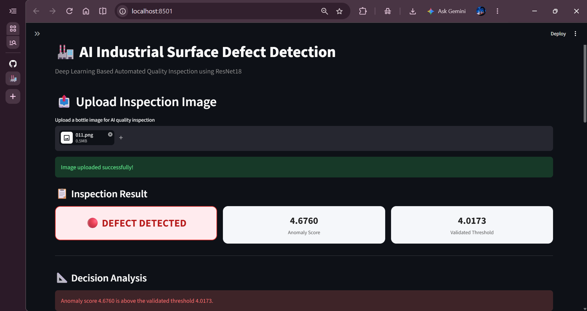
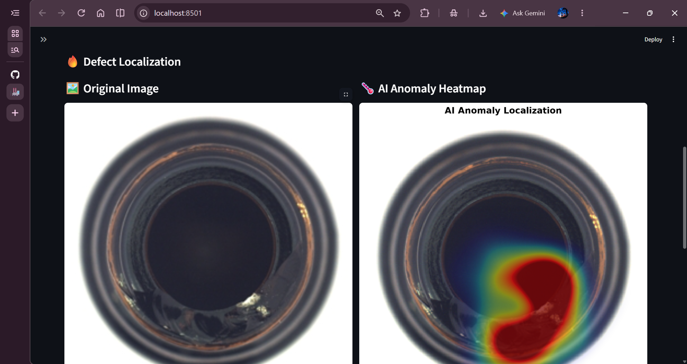

# 🏭 AI-Based Industrial Surface Defect Detection

An AI-powered computer vision system for automated industrial quality inspection using deep learning-based anomaly detection.

The system learns the visual feature representation of normal industrial products and identifies abnormal samples by measuring their feature-space distance from the learned normal representation.

It also provides an anomaly heatmap to visually indicate regions with stronger local feature deviations.

---

## 📌 Project Overview

Manual industrial quality inspection can be time-consuming and may depend heavily on human visual inspection.

This project demonstrates an automated visual inspection pipeline that can classify bottle images as:

- 🟢 GOOD / NORMAL
- 🔴 DEFECT DETECTED

The system uses a pretrained **ResNet18** network as a feature extractor.

Instead of training a complete image classifier from scratch, the pretrained network extracts high-level visual features from normal product images.

A normal feature center is calculated from the training data.

For a new image:

```text
Input Image
     ↓
Image Preprocessing
     ↓
Pretrained ResNet18
     ↓
512-D Feature Vector
     ↓
Euclidean Distance
     ↓
Compare with Validated Threshold
     ↓
GOOD / DEFECT

---

## 📸 Application Demo

### 🔍 Defect Detection Result

The application analyzes an uploaded industrial image and provides an anomaly score compared with the validated threshold.



### 🔥 Defect Localization

The anomaly heatmap provides visual guidance about regions with stronger local feature deviations.



------

## 📸 Application Demo

### 🔍 Defect Detection Result

The application analyzes an uploaded industrial image and provides an anomaly score compared with the validated threshold.


### 🔥 Defect Localization

The anomaly heatmap provides visual guidance about regions with stronger local feature deviations.


---